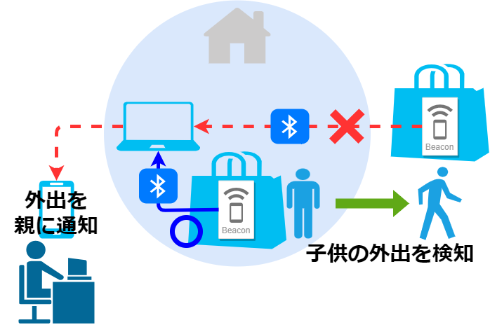

# スマートトラッカーで外出検知



## requirements

* スマートトラッカー（紛失防止タグ）を子供のバックへ装着
* スマートトラッカー（紛失防止タグ）が発信する信号を事前登録しておく
  * トラッカーは`Bluetooth Low Energy (BLE)`の`ビーコン`を定期発信している
  * パソコン（`Raspberry Pi`）で`BLEビーコン`を定期監視する
* 自宅周辺にトラッカーがあれば、何もしない
* 自宅周辺にトラッカーがなければ、親にLINE通知
  * 監視する曜日、時間帯を指定する
  * 通知回数、通知間隔を指定する

## makeup

* スマートトラッカーはBLEビーコンを数百ミリ秒から数秒単位に発信し続けている
  * コイン電池で1年間稼働する
  * BLEビーコンには、機器固有アドレス6byte、信号強度RSSIなどが含まれる
* `Raspberry Pi`には64bitのDebianライクのLinux OSを事前インストール
  * Systemdの定期間隔起動サービスとしてBLEビーコン監視プログラムを登録する
  * `Raspberry Pi`自体はWiFiなどネットワークに接続するとともに、BluetoothもONにする
* 監視プログラムは、ShellまたはPythonで実装する
  * Shellなら、`hcitool`を使用し、BLEスキャンを数秒から数十秒間行う
  * Pythonなら、`bleak`を使用し、BLEスキャンを数秒から数十秒間行う
* 検知した複数の機器固有アドレス6byteから、対象のスマートトラッカーが含まれているか確認する
* 含まれていない場合、LINE通知を行う
  * 平日夕方に1回までの通知を行うなど、制限を設ける。
    * 平日夕方に`STOPファイル`を削除し、これ以降に外出を検知したらLINE通知を行うことが可能とする
    * LINE通知後は`STOPファイル`を配置し、LINE通知を停止する
    * 平日夜までに外出が無い場合は、`STOPファイル`を配置する

## setup

```sh
python -m venv .venv1
source .venv1/bin/activate
pip install bleak

あと、各プログラムで使用している環境変数を設定しておく
・検知対象BLEアドレス
・line通知用
```
